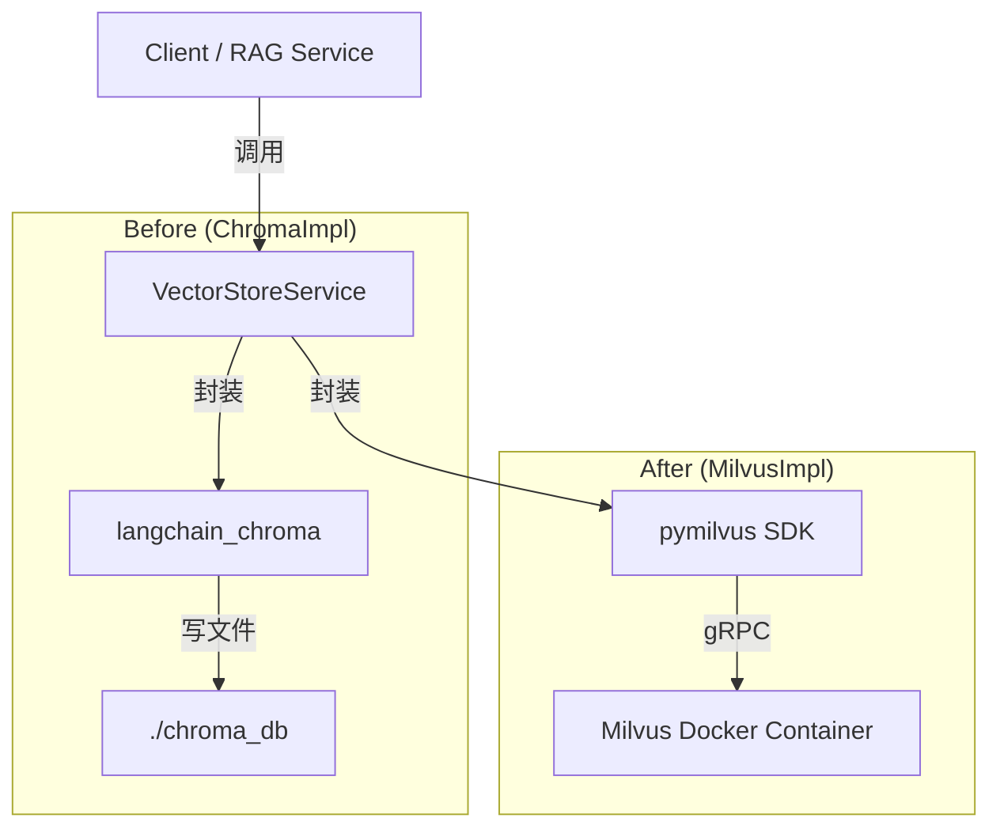

# Milvus 迁移与实现报告

本文档记录了将向量数据库从 **ChromaDB** 迁移至 **Milvus** 的全过程，包括实现逻辑、架构变更以及迁移前后的代码对比。

---

## 1. 迁移背景与目标

原项目使用 ChromaDB 作为向量存储，为了提升在大规模数据下的性能和稳定性，并利用更成熟的生产级特性，决定迁移至 Milvus。

### 核心变更点
- **存储引擎**：嵌入式 ChromaDB (本地文件) $\rightarrow$ Milvus (Docker 容器服务)
- **连接方式**：直连本地目录 $\rightarrow$ TCP/IP 网络连接 (gRPC)
- **数据结构**：简单的 collection $\rightarrow$ 强模式 Schema 定义 (Schema-defined Collection)

---

## 2. 架构设计与实现逻辑

### 2.1 整体架构

迁移采用了**适配器模式 (Adapter Pattern)** 的思想。我们保留了上层业务调用的统一接口 `VectorStoreService`，在底层替换了具体的实现逻辑。



### 2.2 核心实现逻辑

1.  **连接管理**：
    *   **Old**: 初始化时指定本地路径 `persist_directory`。
    *   **New**: 初始化时建立全局连接 `connections.connect(...)`，指向 Milvus 服务端口 (19530)。

2.  **Schema 定义**：
    *   **Old**: ChromaDB 是 Schema-less 的，直接丢进去 Document 对象即可。
    *   **New**: Milvus 需要明确定义 Schema（ID、doc_id、content、embedding 等字段类型和维度），这增加了严谨性。

3.  **索引构建**：
    *   **Old**: 隐式处理，依赖 Chroma 内部机制。
    *   **New**: 显式创建 `IVF_FLAT` 索引，并指定 metric_type 为 `L2` (欧氏距离)。

4.  **混合检索 (Hybrid Search) 适配**：
    *   项目原本利用了 Chroma 的 `as_retriever()` 配合 `BM25Retriever` 做混合检索。
    *   迁移后，我们实现了一个自定义的 `MilvusRetriever` 类，使其符合 LangChain 的 `BaseRetriever` 接口规范，从而无缝接入原有的混合检索逻辑。

---

## 3. 代码实现对比

### 3.1 配置文件 (config.py)

配置项从本地路径改为服务地址。

| 特性 | ChromaDB (旧) | Milvus (新) |
| :--- | :--- | :--- |
| **连接** | 指定文件路径 | 指定 Host 和 Port |

```python
# Before: ChromaDB
collection_name = "fitness_knowledge"
persist_directory = os.path.join(os.path.dirname(__file__), "chroma_db")

# After: Milvus
milvus_host = os.getenv("MILVUS_HOST", "localhost")
milvus_port = os.getenv("MILVUS_PORT", "19530")
collection_name = "fitness_knowledge"
```

### 3.2 向量库初始化 (__init_vector_store)

这是改动最大的部分。Chroma 一行代码搞定，Milvus 需要详细的“建表”过程。

**Before (ChromaDB)**:
```python
# 简单直接，并在本地初始化
self.vector_store = Chroma.from_documents(
    documents=docs,
    embedding=self.embedding,
    collection_name=config.collection_name,
    persist_directory=config.persist_directory,
)
```

**After (Milvus)**:
```python
# 1. 建立连接
connections.connect(host=config.milvus_host, port=config.milvus_port)

# 2. 定义字段 (Schema)
fields = [
    FieldSchema(name="id", dtype=DataType.INT64, is_primary=True, auto_id=True),
    FieldSchema(name="content", dtype=DataType.VARCHAR, max_length=65535),
    FieldSchema(name="embedding", dtype=DataType.FLOAT_VECTOR, dim=dim),
    # ... 其他元数据字段
]
schema = CollectionSchema(fields)

# 3. 创建集合与索引
self.collection = Collection(collection_name, schema)
index_params = {
    "index_type": "IVF_FLAT", 
    "metric_type": "L2", 
    "params": {"nlist": 128}
}
self.collection.create_index("embedding", index_params)
```

### 3.3 文档添加 (add_document)

Milvus 的插入方式更接近传统的 SQL Insert，不仅要插入数据，还要计算向量。

**Before (ChromaDB)**:
```python
# LangChain 封装好了，自动计算 embedding
self.vector_store.add_documents([doc])
```

**After (Milvus)**:
```python
# 1. 手动调用 Embedding 模型计算向量
embedding = self.embedding.embed_query(content)

# 2. 构造按列存储的数据 (Column-based)
data = [
    [doc_id],               # doc_id 列
    [content],              # content 列
    [embedding]             # embedding 向量列
]

# 3. 插入并刷新
self.collection.insert(data)
self.collection.flush()
```

### 3.4 检索适配器 (MilvusRetriever)

为了复用上层的 RAG 逻辑，我们必须把 Milvus 的查询结果包装成 LangChain 的 Document 对象。

```python
class MilvusRetriever(BaseRetriever):
    def _get_relevant_documents(self, query: str, **kwargs) -> List[Document]:
        # 1. 计算查询向量
        query_vector = self.embedding.embed_query(query)
        
        # 2. Milvus 搜索
        results = self.collection.search(
            data=[query_vector],
            anns_field="embedding",
            param={"metric_type": "L2", "params": {"nprobe": 10}},
            limit=self.top_k,
            output_fields=["content", "title", "source"]
        )
        
        # 3. 结果对象转换 (Hit -> Document)
        docs = []
        for hit in results[0]:
            doc = Document(
                page_content=hit.entity.get("content"),
                metadata={"score": hit.distance, ...}
            )
            docs.append(doc)
        return docs
```

---

## 4. 迁移总结

通过本次迁移，我们在保持上层业务逻辑（RAG Service、Hybrid Search、Rerank）完全零感知的情况下，成功切换了底层存储引擎。

*   **性能**：Milvus 的 IVF_FLAT 索引在大数据量下检索速度更快。
*   **扩展性**：支持了 Docker 部署，使得向量库可以独立于应用服务扩展。
*   **规范性**：引入了 Schema 定义，数据结构更加规范可控。
