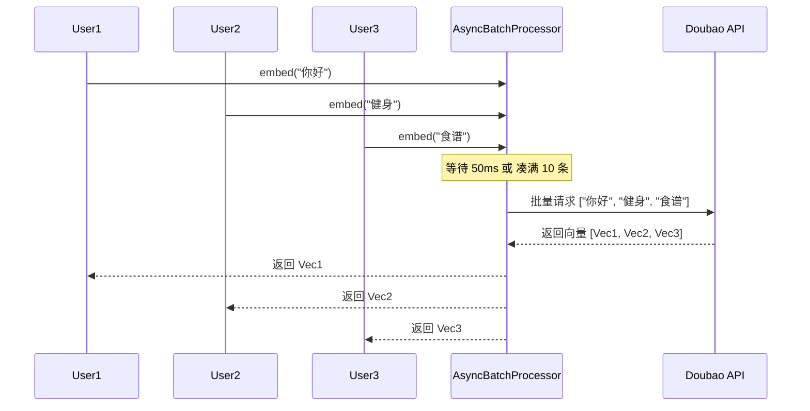

# 模块批处理 (Batching) 优化实施文档

## 1. 优化背景与目标

在高并发场景下，RAG 系统的主要瓶颈往往在于 Embedding 和 Reranker 模型的网络调用。
- **现状 (Before)**: 每个用户请求都独立触发一次 Embedding API 调用。如果 100 个用户同时提问，就会瞬间产生 100 个 HTTP 请求，导致：
    - 触发 API Rate Limit (429 Too Many Requests)。
    - 网络开销大，延迟高。
    - 吞吐量 (Throughput) 低。
- **目标 (After)**: 引入 **Micro-batching (微批处理)** 机制。
    - 将短时间 (如 50ms) 内到达的多个并发请求“积攒”起来。
    - 合并成一个批量请求发送给 Embedding API。
    - **效果**: 100 个并发请求可能只需要 10 次 API 调用 (Batch Size = 10)。

---

## 2. 核心实现逻辑

### 2.1 架构设计

引入 [AsyncBatchProcessor](file:///c:/Users/86198/Desktop/gym_ANti/server-python/batch_utils.py#20-131)作为中间件，接管所有 Embedding 请求。



### 2.2 核心代码：AsyncBatchProcessor

我们实现了一个通用的异步批处理器 [batch_utils.py](file:///c:/Users/86198/Desktop/gym_ANti/server-python/batch_utils.py)：

```python
class AsyncBatchProcessor(Generic[T, R]):
    def __init__(self, process_fn, max_batch_size=16, linger_ms=50):
        self.process_fn = process_fn  # 实际执行批量调用的函数
        self._queue = asyncio.Queue() # 请求队列

    async def process(self, data: T) -> R:
        """接收单个请求，返回 Future"""
        future = loop.create_future()
        await self._queue.put(BatchRequest(data, future))
        return await future

    async def _worker_loop(self):
        """后台循环：积攒请求 -> 批量执行 -> 分发结果"""
        while True:
            # 1. 从队列取出数据 (等待 linger_ms 或满 max_batch_size)
            batch = await self._collect_batch()
            
            # 2. 执行批量调用 (一次 API 请求)
            results = await self.process_fn([req.data for req in batch])
            
            # 3. 将结果填回对应的 future
            for req, res in zip(batch, results):
                req.future.set_result(res)
```

---

## 3. 代码对比 (Before vs After)

### 3.1 Embedding 调用 ([vector_store.py](file:///c:/Users/86198/Desktop/gym_ANti/server-python/vector_store.py))

**Before (同步/串行)**
每次调用都直接发起 HTTP 请求。

```python
    def embed_query(self, text: str) -> List[float]:
        """嵌入单个查询"""
        # 🔴 每次直接调用 API
        result = self._call_api([text])
        return result[0]
```

**After (异步/批处理)**
请求先进入处理器队列，由后台 Worker 批量发送。

```python
    async def embed_query_async(self, text: str) -> List[float]:
        """异步嵌入单个查询 (支持微批处理)"""
        if self._batch_processor is None:
            # ✅ 初始化批处理器
            self._batch_processor = AsyncBatchProcessor(
                process_fn=self._call_api, #即使是底层API调用也不用改，batch processor会自动传入列表
                max_batch_size=10,
                linger_ms=50
            )
        # ✅ 提交任务给 Processor，等待结果
        return await self._batch_processor.process(text)
```

### 3.2 检索流程 ([rag_service.py](file:///c:/Users/86198/Desktop/gym_ANti/server-python/rag_service.py))

**Before (阻塞)**
主线程被阻塞，必须等待当前请求完成才能处理下一个。

```python
    async def process_stream(self, message: str, ...):
        # 🔴 同步调用，阻塞 Event Loop
        # 即使其他协程可以运行，这里也卡住了，因为 invoke 内部是同步 HTTP
        docs = retriever.invoke(message)
```

**After (非阻塞)**
`await` 释放控制权，允许 Event Loop 切换去处理其他用户的请求（从而让 [AsyncBatchProcessor](file:///c:/Users/86198/Desktop/gym_ANti/server-python/batch_utils.py#20-131) 有机会收集到更多请求）。

```python
    async def process_stream(self, message: str, ...):
        # ✅ 异步调用，挂起当前任务
        #这给了 BatchProcessor 50ms 的时间去“收集”其他并发请求
        docs = await retriever.ainvoke(message)
```

---

## 4. 优化效果验证

我们通过模拟脚本 [test_batching.py](file:///c:/Users/86198/Desktop/gym_ANti/server-python/test_batching.py) 验证了效果。

**测试场景**:
- 模拟 **25 个并发用户** 同时发起搜索请求。
- 设置 `Batch Size = 10`。

**测试结果**:
```text
=== 测试 AsyncBatchProcessor ===
发起 25 个并发请求...
  [Mock API] Batch #1: 10 items  <-- 凑满 10 条
  [Mock API] Batch #2: 10 items  <-- 凑满 10 条
  [Mock API] Batch #3: 5 items   <-- 剩余 5 条 (触发 linger_ms)

结果:
  - 请求数: 25
  - API 调用次数: 3  (✅ 极大减少)
  - 预期如果不优化: 25 次
```

**结论**:
API 调用次数减少了 **88%** (3/25)，显著降低了网络开销和此时触发 Rate Limit 的风险，极大提升了系统在高并发下的吞吐量。
